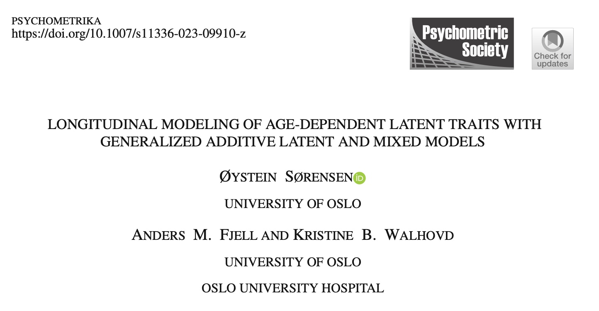
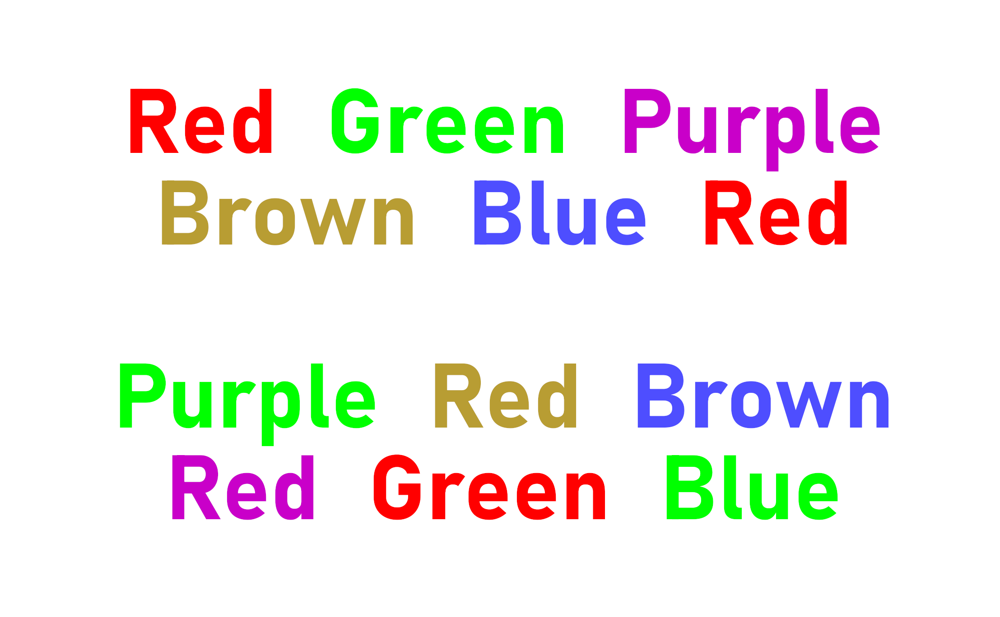
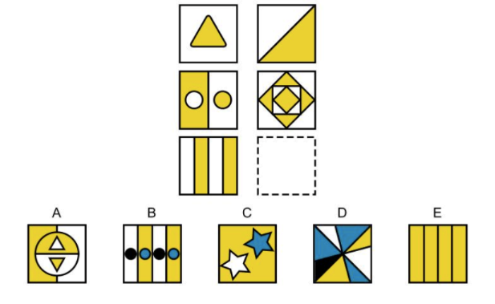
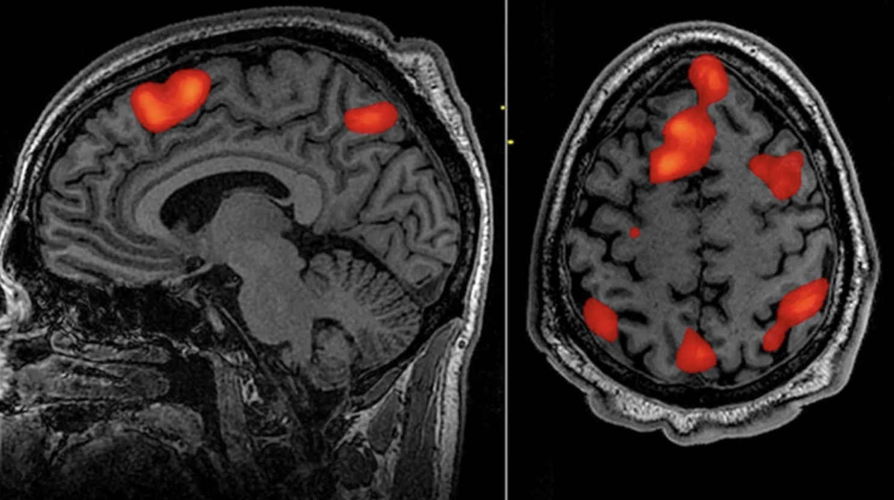
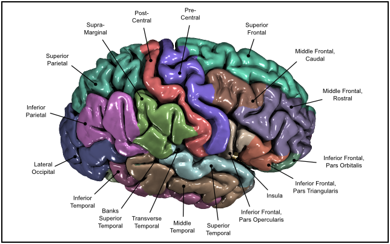
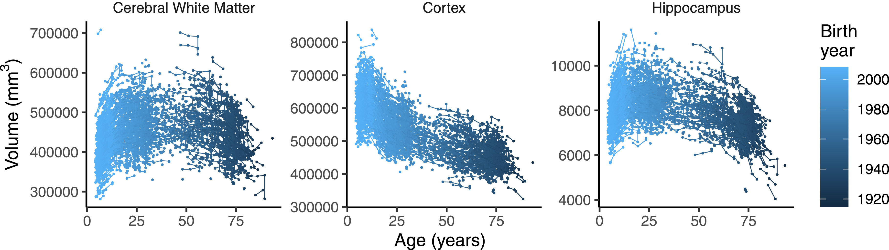
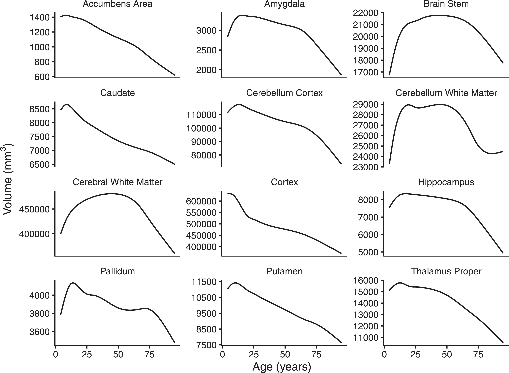
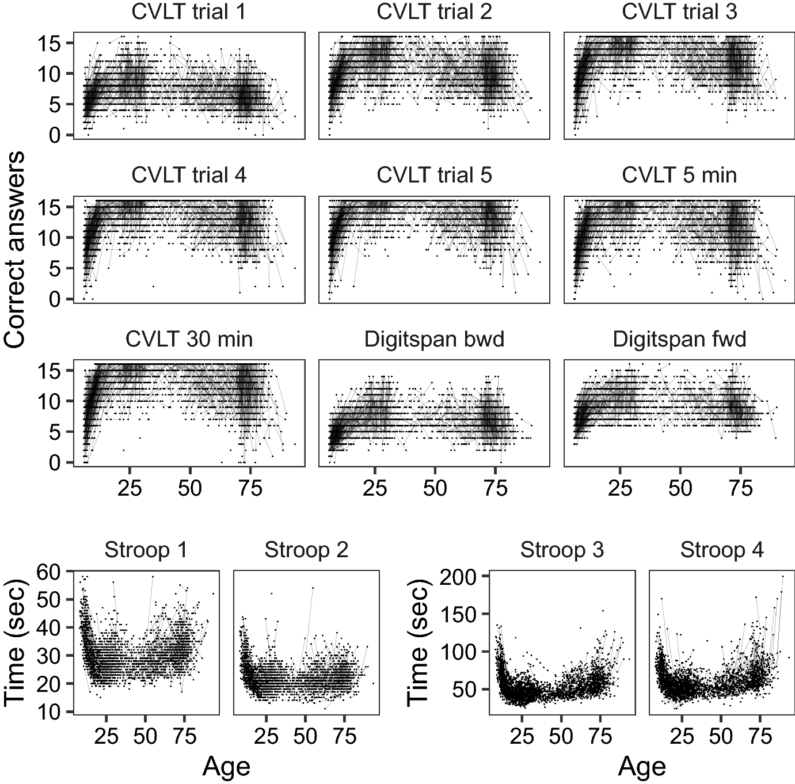
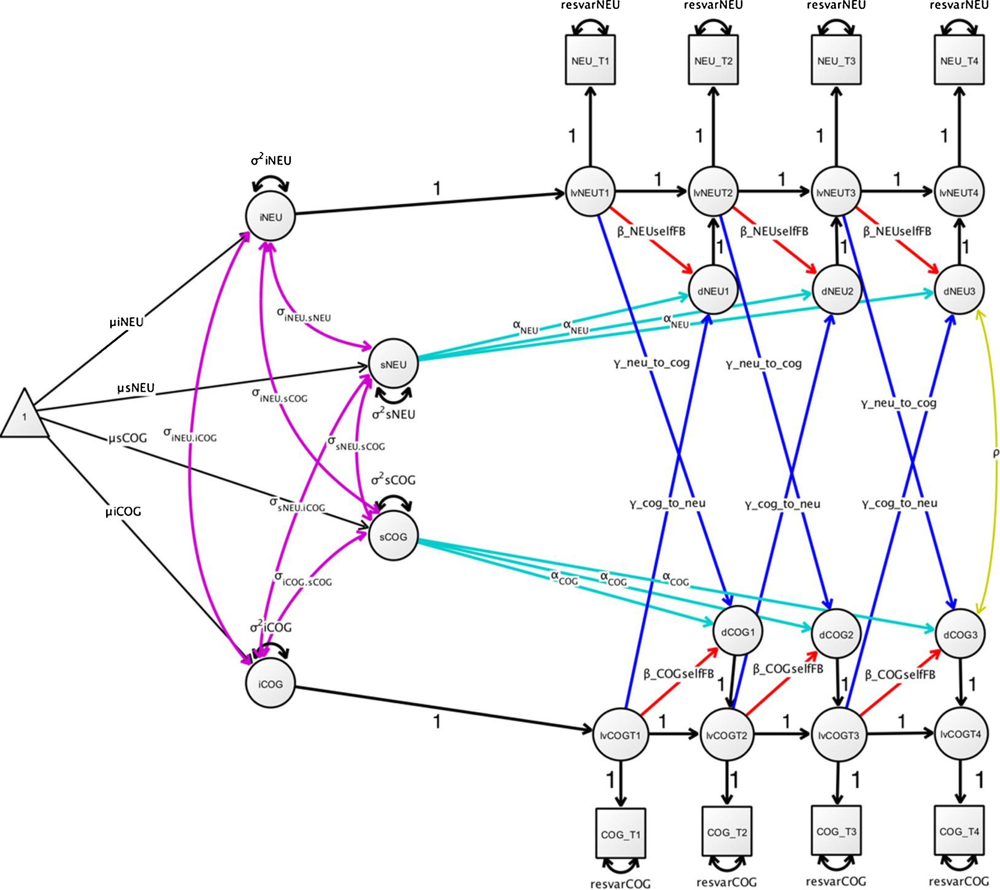

class: middle, center

<table><tr><td>

</td></tr></table>

---

# Cognitive Neuroscience

- How does brain **function** relate to brain **structure** and **activity**?

.pull-left[

]

--

.pull-right[

]

???

Mention how this is particularly relevant in studies of development in children, but also in aging.

---

# Structural MRI Data

???

---

# Structural MRI Data

---

---

class: center

# Natural Modeling Approach

.footnote[
Kievit, R. A., Brandmaier, A. M., Ziegler, G., van Harmelen, A.-L., de Mooij, S. M. M., Moutoussis, M., Goodyer, I. M., Bullmore, E., Jones, P. B., Fonagy, P., Lindenberger, U., & Dolan, R. J. (2018). Developmental cognitive neuroscience using latent change score models: A tutorial and applications. Developmental Cognitive Neuroscience, 33, 99–117. https://doi.org/10.1016/j.dcn.2017.11.007
]

---

# However...

- Different brain regions follows idiosyncratic nonlinear trajectories:

---

- Cognitive function kind of does too:

---

# However as well

- Timepoints are irregular

- Data come from different studies. Different versions of MR scanners and cognitive tests are often used.

- Responses are of multiple types

No easy way of modeling all of this. Cognitive test scores often reduced to a single principal component or sumscore.

---

# Is there a way out?

- Generalized linear latent and mixed models (GLLAMM) gets us far.

It allows:

- Irregular timepoints

- Mixed response types

- Controling for all kinds of covariates

It lacks:

- Automatic estimation of nonlinear effects

- Scalable algorithms for crossed random effects

- R package

.footnote[
GLLAMM: Rabe-Hesketh, S., Skrondal, A., & Pickles, A. (2004). Generalized multilevel structural equation modeling. Psychometrika, 69(2), 167–190. https://doi.org/10.1007/BF02295939
]

---

# Generalized Additive Latent and Mixed Models

## Automatic estimation of nonlinear effects

- Smoothing splines implemented as mixed models

## Scalable algorithms for crossed random effects

- Sparse matrix methods combined with the Laplace approximation

## R package

- R wrapper to C++ implementation
