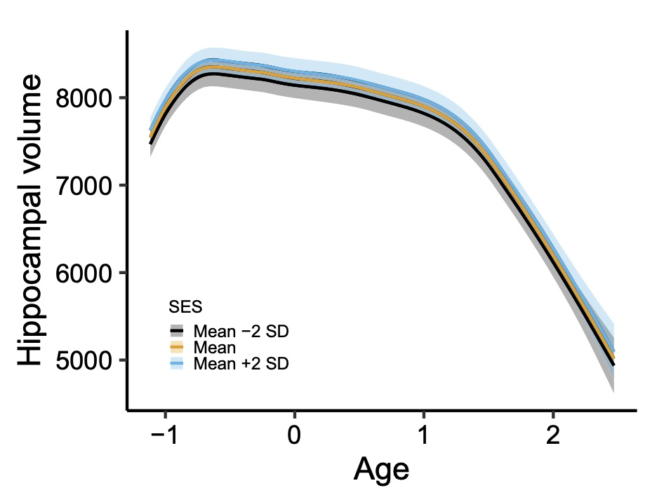

class: middle, center

<table><tr><td>

</td></tr></table>

---

class: inverse, middle, center

# Motivating Applications

---

# Cognitive Neuroscience

- How does brain **function** relate to brain **structure** and **activity**?

.pull-left[

]

--

.pull-right[

]

???

Mention how this is particularly relevant in studies of development in children, but also in aging.

---

class: center

# Structural MRI Data

Data from LCBC: https://www.oslobrains.no/

???

---

class: center

# Structural MRI Data

---

class: center

# Cognitive Test Data

---

# Cognitive Test Data

.pull-left[

In this figure:

- California Verbal Learning Test. (CVLT) measures episodic memory.

- Digit span test measures working memory.

- Stroop tests measures speed and executive function.

]

.pull-right[

]

---

# Research Questions

- How is change in a cognitive domain correlated with brain change?

- Can we find major factors of brain aging, or of cognitive aging?

  - Similarly for development, which is kind of very early aging(!?)

- Can we measure effects of, e.g., memory training?

- How do genes and environment impact all of this?

---

# Natural Approach - Some kind of SEM?

.footnote[
Kievit, R. A., et al. (2018). Developmental Cognitive Neuroscience, 33, 99–117. https://doi.org/10.1016/j.dcn.2017.11.007
]

---

# Natural Approach - Some kind of SEM?

.footnote[
Cox, S. R., et al. (2021). Molecular Psychiatry, 26(6), 2651–2662. https://doi.org/10.1038/s41380-020-00975-1
]

---

# However...

- How to capture these effects with a parametric model?

---

# However...

- How to capture these effects with a parametric model?

???

Mention the requirement that some parametric form must be imposed a priori.

---

# Other Issues with Classical SEM

- To get large datasets we must accept irregular $\Delta t$

- Complex grouping structure: Multiple centers, scanners, test versions

- Multiple response types

- Need to add covariates, e.g., retest effects

--

Models exists out there to handle all of this, but terribly hard to use in practice.

- Sum scores and mixed models are hence often used.

---

# Generalized Linear Latent and Mixed Models?

GLLAMM by Rabe-Hesketh, Skrondal et al.: The tool cognitive neuroscience needs to discover?

--

It allows:

- Irregular timepoints

- Mixed response types

- Covariates/predictors

But it lacks:

- Automatic estimation of nonlinear effects

- Scalable algorithms for crossed random effects

- R package

.footnote[
Rabe-Hesketh, S., Skrondal, A., & Pickles, A. (2004).  Psychometrika, 69(2), 167–190. https://doi.org/10.1007/BF02295939
]

---

# Proposed Framework

Generalized **additive** latent and mixed models (GALAMMs).

- Extends GLLAMMs by allowing allowing all responses to depend on **smooth functions** of any observed covariates.

- Efficient computation with sparse matrix methods and Laplace approximation

- R package `galamm` (in progress)

---

class: inverse, middle, center

# Generalized Additive Latent and Mixed Models

---

# Response

- Exponential family

$$f\left(y | \theta, \phi\right) = \exp \left( \frac{y\theta - b\left(\theta(\mu)\right)}{\phi} + c\left(y, \phi\right) \right)$$

$b(\cdot)$ and $c(\cdot)$ can vary between observations.

---

# (Non)Linear Predictor

$$\boldsymbol{\nu} = \sum_{s=1}^{S} f_{s}\left(\mathbf{x}\right) + \sum_{l=2}^{L}\sum_{m=1}^{M_{l}} \eta_{m}^{(l)} \mathbf{z}^{(l)}_{m}{}^{'}\boldsymbol{\lambda}_{m}^{(l)}$$

- Predictors $\mathbf{x}$ and $\boldsymbol{z}^{(l)}_{m}$, $S$ smooth functions, $L$ levels, each with $M_{l}$ latent variables.

- Factor loadings $\boldsymbol{\lambda}_{m}^{(l)}$, latent variables $\eta_{m}^{(l)}$.

--

### Note

- Corresponds to the measurement model in a SEM.

- Special cases: $f_{s}(\mathbf{x}) = \mathbf{x}^{T}\boldsymbol{\beta}$ and $f_{s}(\mathbf{x}) = \boldsymbol{\beta}_{0}$.

---

# Structural Model

$$\boldsymbol{\eta} = \mathbf{B}\boldsymbol{\eta} + \mathbf{h}\left(\mathbf{w}\right) + \boldsymbol{\zeta}$$

- $\mathbf{B}$ contains coefficients for regression between latent variables.

- Vector of smooth functions $\mathbf{h}(\mathbf{w})$.

- Disturbances $\boldsymbol{\zeta} \sim N(\boldsymbol{0}, \boldsymbol{\Psi})$, i.e., random effects.

---

# Smoothing

Smooth functions $f_{s}\left(\mathbf{x}\right)$ in nonlinear and in structural model $\mathbf{h}(\mathbf{w})$ are linear combinations of given basis functions, e.g.,

$$f(x) = \sum_{k=1}^{K} \beta_{k} b_{k}(x)$$

with penalty $\int f''(x)^{2} \text{d}x$.

--

- Resulting penalized likelihood equivalent to that of a mixed model.

- Random effect design matrix composed of parts of $\{b_{1}(x), \dots, b_{K}(x)\}$ in penalty range space, and fixed effect design matrix composed of parts in penalty nullspace. In other words, penalized coefficients become random effects.

- Smoothing parameters correspond to precision, so high variance means more wiggly fits.

---

# Main Result

- By transforming all smooth functions to their mixed effect counterpart, a GALAMM with $L$ levels becomes a GLLAMM with $L+1$ levels.

--

- A GLLAMM is a nonlinear mixed model, and can be estimated using maximum marginal likelihood:

$$L\left(\boldsymbol{\beta}, \boldsymbol{\Lambda}, \boldsymbol{\Gamma}, \boldsymbol{\lambda}, \mathbf{B}, \boldsymbol{\phi}\right) =  \left(2 \pi \phi_{1}\right)^{-r/2}  \int_{\mathbb{R}^{r}} \exp\left( g\left(\boldsymbol{\beta}, \boldsymbol{\Lambda}, \boldsymbol{\Gamma}, \boldsymbol{\lambda}, \mathbf{B}, \boldsymbol{\phi}, \mathbf{u}\right) \right) \text{d} \mathbf{u}$$

where

$$g\left(\boldsymbol{\beta}, \boldsymbol{\Lambda}, \boldsymbol{\Gamma}, \boldsymbol{\lambda}, \mathbf{B}, \boldsymbol{\phi}, \mathbf{u}\right) = \mathbf{y}^{T} \mathbf{W}\boldsymbol{\nu} - d\left(\boldsymbol{\nu}\right)^{T} \mathbf{W}\mathbf{1}_{n}  + c\left(\mathbf{y}, \boldsymbol{\phi}\right)^{T} \mathbf{1}_{n} - \left(2\phi_{1}\right)^{-1} \left\| \mathbf{u} \right\|^{2}$$

- Uncorrelated random effects $\mathbf{u}$, related to natural parametrization through $\boldsymbol{\Lambda}\mathbf{u} = \boldsymbol{\zeta} \sim N(\mathbf{0}, \boldsymbol{\Psi})$, with $\boldsymbol{\Psi} = \phi \boldsymbol{\Lambda}\boldsymbol{\Lambda}^{T}$.

---

# Algorithm

We want to find

$$\left\{\hat{\boldsymbol{\beta}}, \hat{\boldsymbol{\Lambda}}, \hat{\boldsymbol{\Gamma}}, \hat{\boldsymbol{\lambda}}, \hat{\mathbf{B}}, \hat{\boldsymbol{\phi}} \right\} = \text{argmin}\left\{ L\left(\boldsymbol{\beta}, \boldsymbol{\Lambda}, \boldsymbol{\Gamma}, \boldsymbol{\lambda}, \mathbf{B}, \boldsymbol{\phi}\right) \right\}$$

where

$$L\left(\boldsymbol{\beta}, \boldsymbol{\Lambda}, \boldsymbol{\Gamma}, \boldsymbol{\lambda}, \mathbf{B}, \boldsymbol{\phi}\right) =  \left(2 \pi \phi_{1}\right)^{-r/2}  \int_{\mathbb{R}^{r}} \exp\left( g\left(\boldsymbol{\beta}, \boldsymbol{\Lambda}, \boldsymbol{\Gamma}, \boldsymbol{\lambda}, \mathbf{B}, \boldsymbol{\phi}, \mathbf{u}\right) \right) \text{d} \mathbf{u}$$

--

### Laplace Approximation

Find

$$\tilde{\mathbf{u}} = \tilde{\mathbf{u}}\left(\boldsymbol{\beta}, \boldsymbol{\Lambda}, \boldsymbol{\Gamma}, \boldsymbol{\lambda}, \mathbf{B}, \phi, \mathbf{u}\right) = \underset{\mathbf{u}}{\text{argmax}} \left\{ g\left(\boldsymbol{\beta}, \boldsymbol{\Lambda}, \boldsymbol{\Gamma}, \boldsymbol{\lambda}, \mathbf{B}, \phi, \mathbf{u}\right) \right\}$$

together with gradient $\boldsymbol{\nabla} g$ and Hessian $\mathbf{H}_{g}$. Then approximate $g(\cdot)$ with second-order Taylor expansion around $\tilde{\mathbf{u}}$, so the integral gets an analytical solution.

---

# Algorithm

### Outer loop

Search over the feasible set to find

$$\left\{\hat{\boldsymbol{\beta}}, \hat{\boldsymbol{\Lambda}}, \hat{\boldsymbol{\Gamma}}, \hat{\boldsymbol{\lambda}}, \hat{\mathbf{B}}, \hat{\boldsymbol{\phi}} \right\}$$

that maximize Laplace approximate marginal likelihood.

### Inner loop

For each candidate set of outer loop parameters, find random effects

$$\tilde{\mathbf{u}} =  \underset{\mathbf{u}}{\text{argmax}} \left\{ g\left(\boldsymbol{\beta}, \boldsymbol{\Lambda}, \boldsymbol{\Gamma}, \boldsymbol{\lambda}, \mathbf{B}, \phi, \mathbf{u}\right) \right\}$$

and use these to compute the value of the Laplace approximate marginal likelihood.

---

# Inner loop

- Finding random effects $\tilde{\mathbf{u}}$ is a penalized iteratively reweighted least squares problem.

- Sparse Cholesky factorization of Hessian, with permutation $\mathbf{P}$ only dependent on sparsity pattern,

$$\mathbf{L} \mathbf{D} \mathbf{L}^{T} = -\mathbf{P}  \mathbf{H}_{g} \mathbf{P}^{T}$$

--

- Updates $\mathbf{u}^{(k+1)} = \mathbf{u}^{(k)} + \tau \boldsymbol{\delta}^{(k)}$, increments at iteration $k$ given by

$$\mathbf{L}^{(k)} \mathbf{D}^{(k)} \mathbf{L}^{(k)T} \mathbf{P} \boldsymbol{\delta}^{(k)} = \mathbf{P} \left( \boldsymbol{\Lambda}^{T} \mathbf{Z}^{T} \mathbf{W}^{(k)} \left( \mathbf{y} - \boldsymbol{\mu}^{(k)}\right)- (1/\phi_{1}^{(k)}) \mathbf{u}^{(k)}\right)$$

- In case it helps intuition, the equivalent system in linear regression is $\mathbf{X}^{T}\mathbf{X} \boldsymbol{\beta} = \mathbf{X}^{T} \mathbf{y}$.

- Control of stepsize $\tau$ turned out to be necessary in practice.

---

# Outer loop

- "Design matrices" depend on parameters, so must be updated.

--

- Laplace approximate marginal log-likelihood is

$$\mathbf{y}^{T} \mathbf{W}\boldsymbol{\nu} - b\left(\boldsymbol{\nu}\right)^{T} \mathbf{W}\mathbf{1}_{n}  + c\left(\mathbf{y}, \boldsymbol{\phi}\right)^{T} \mathbf{1}_{n} - \left(2\phi_{1}\right)^{-1} \left\| \tilde{\mathbf{u} }\right\|^{2} - (1/2)\log \text{tr}\left(\mathbf{D}\right)$$

- Hard do differentiate this with respect to $\{\boldsymbol{\beta}, \boldsymbol{\Lambda}, \boldsymbol{\Gamma}, \boldsymbol{\lambda}, \mathbf{B}, \boldsymbol{\phi}\}$. Automatic differentiation turned out to be useful.

--

- Box constraints typically present as well. L-BFGS-B algorithm worked well.

---

class: inverse, middle, center

# Open Questions

---

# More Accurate Integral Approximations?

The computational bottleneck is this integral, where $r$ can easily reach 50,000:

$$\left(2 \pi \phi_{1}\right)^{-r/2}  \int_{\mathbb{R}^{r}} \exp\left( g\left(\boldsymbol{\beta}, \boldsymbol{\Lambda}, \boldsymbol{\Gamma}, \boldsymbol{\lambda}, \mathbf{B}, \boldsymbol{\phi}, \mathbf{u}\right) \right) \text{d} \mathbf{u}$$

- Standard Laplace approximation has known issues, but also advantages.

- Is it possible to formulate higher-order Laplace approximations in terms of sparse matrix operations, and thus allows efficient computation also with very complex nesting structures, e.g., crossed random effects? (Andersson & Xin, 2021, Raudenbush et al., 2000).

--

- The same question goes for Gauss-Hermite quadrature. Ogden (2015) has shown how one can find *one* factorization (out of many) of the empirical Bayes posterior with cross random effects, and use this when computing integrals.

- Or should we just resort to Stan? https://mc-stan.org/

---

# Wald type CIs sometimes bad

.pull-left[

]
.pull-right[

- Means that marginal log-likelihood is poorly approximated by quadratic function near maximum.

- Profile likelihood methods maybe better, but can they be made computationally feasible?

]

---

# Nonsensical zero variance estimates

.pull-left[

- $\psi_{m}^{(2)}$ is between-timepoint within-participant variance

- $\psi_{m}^{(3)}$ is between-participant variation

]
.pull-right[

- Hodges (2014) develops some theory for this. Possible to extend to more complicated models?

 

]

---

# CI coverage for smooth terms not optimal

- Smooth is linear combinations of fixed and random effects.

- Possible to take smoothing parameter uncertainty into account when computing CIs for random effects (Wood, Pya, and Säfken, JASA, 2016)?

---

# Measurement Invariance

- Factor loadings for given tests are likely to change both over time and with covariates like age. 

- Conceptually possible in the framework, but likely to yield computational challenges.

  
  
---

# R package

- All numerics implemented in C++. Template metaprogramming to allow automatic differentiation.

- Hard to create a simple and stable R interface to C++ code, because of all the different types of parameters.

  - Mappings between parameters and low-level representation needs to be created on-the-fly.

- What is best?

  - Syntax inspired by `lme4`, closer to mixed models?
  
  - Synes closer to `lavaan`?

- Development version available from https://lcbc-uio.github.io/galamm/.

---

class: inverse middle, center

# Thank you!

### Any questions?